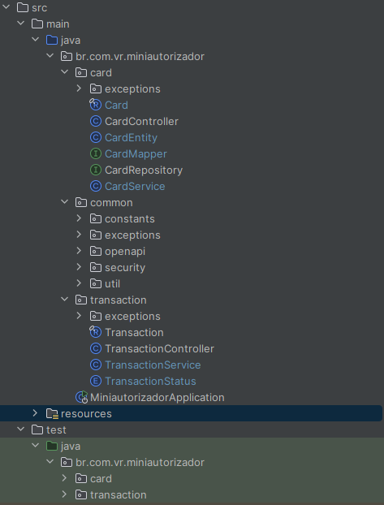
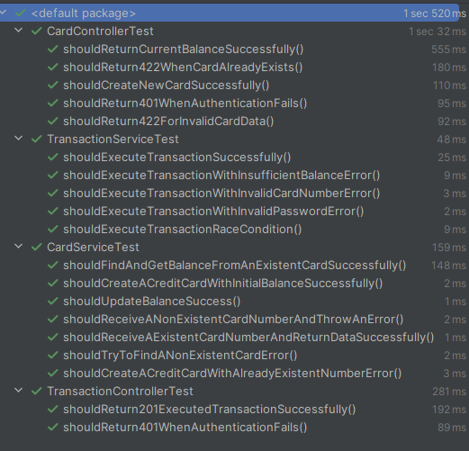

## Visão Geral
* Criação de um cartão
* Verificar o saldo do cartão
* Realizar transação
* Utilização da abordagem do Vertical Slice para a estruturação do projeto baseado nas features Cartão e Transação.

# Tecnologias utilizadas
* Java 21
* Spring Boot 3.3.2
* Spring Security
* MongoDB
* JUnit 5
* Mockito
* Maven

## Escolha banco de dados
* O BD escolhido foi o MongoDB pensando na flexibilidade para a evolução dos modelos dos documentos dentro de uma coleção e porque o modelo de dados é simples e não necessita de relacionamentos complexos.

## Testes unitários
* Foram realiazados testes unitários para as classes os controllers e services.
